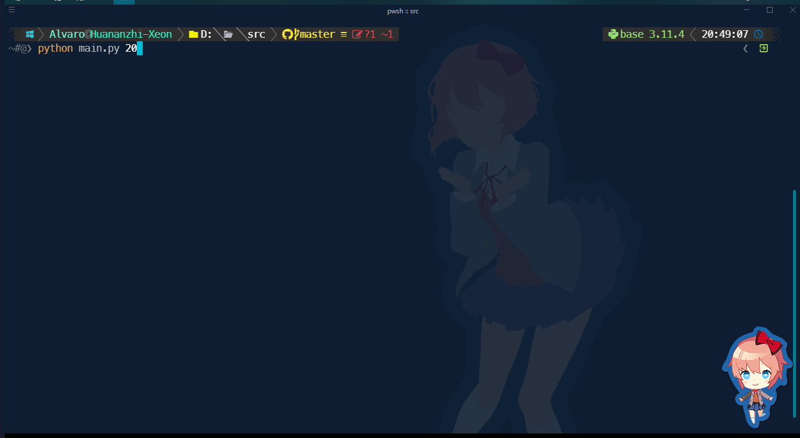
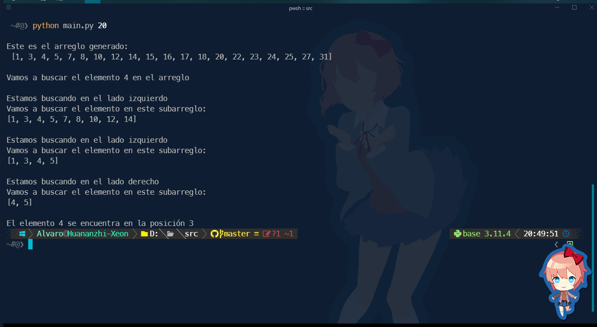
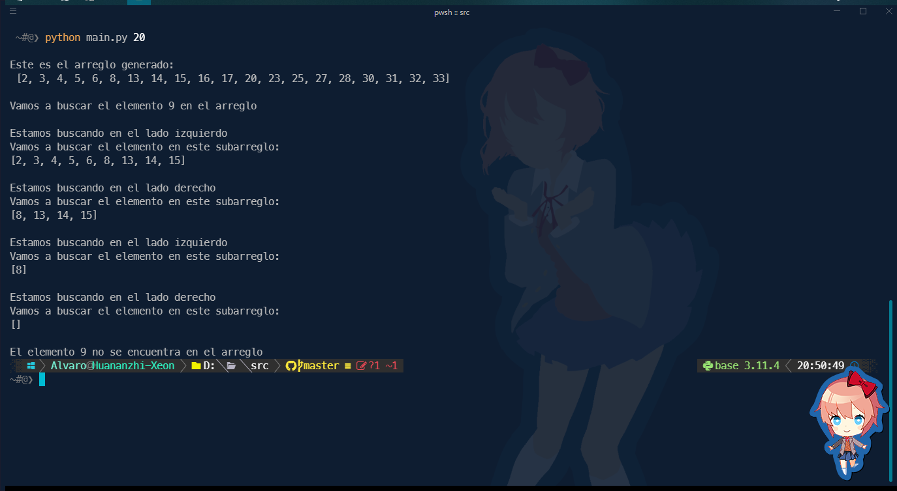

<br>
<table>
  <tr>
    <td></td>
    <td style="text-align: center;">
    UNIVERSIDAD NACIONAL AUTÓNOMA DE MÉXICO <br>
      FACULTAD DE CIENCIAS<br>
      ANÁLISIS DE ALGORITMOS 
    </td>
    <td></  <td style="text-align: center;">
  </tr>
</table>

## Práctica 2. Búsquedas

- **Alumno:** Alvaro Ramírez López
- **N° de cuenta:** 316276355
- **Profesores**:

  - **Titular**: María De Luz Gasca Soto
  - **Ayudantes**:
    - Rodrigo Fernando Velázquez Cruz
    - Teresa Becerril Torres

## Ejecución del programa

Para realizar la ejecución de los programas se debe de contar con la version de python 3.11.4.

Para ejecutar el programa, primero deberemos de extraer el contenido el .zip, luego buscamos esa ruta en la terminal y nos movemos a la carpeta src/, ahi vamos a ejecutar el siguiente comando.

```bash
python main.py <tamaño_del_arreglo>
```

Para algunas personas pueden ejecutar como python o python3, sera dependiendo de su instalacion y si tienen alguna version de Python 2 instalada.

## Representación de la solución

Para realizar la solución del problema, se deberá de explicar las dos funciones que se implementaron para resolver el problema.

### Función _genera_arreglo(n)_

Esta función se encarga de generar un arreglo de tamaño n, con números aleatorios entre 0 y $n$, para esto se utilizo la librería random de python, la cual nos permite generar números aleatorios en un rango en especifico, pero se noto que al generar el arreglo este contenía números repetidos, esto nos afectaba si queríamos generar un arreglo con 10 elementos pero al ver el arreglo de esos 10 elementos 2 eran iguales, entonces eso anulaba la siguiente restricción:

Dado un arreglo $A[0..n − 1]$ de $n$ enteros, tal que $∀i$, $0≤i≤n−1$, se tiene que $|A[i] − A[i + 1]| ≤ 1$; si $A[0] = x$ y $A[n − 1] = y$ se tiene que $x < y.$.

Para corregir lo anterior se opto por hacer que la generación del arreglo fuera de la siguiente manera:

```python
  arreglo = [random.randint(1, n*2) for _ in range(n*2)]
```

Esto nos genera un arreglo de tamaño $2n$ con números aleatorios entre 1 y $2n$, pero tenemos la posibilidad de que el arreglo generado tenga números repetidos, por lo que se opto por hacer lo siguiente:

```python
arreglo = list(set(arreglo))
```

Esto elimina los elementos repetidos del arreglo, pero nos genera un nuevo problema, el arreglo generado puede tener un tamaño mayor a $n$, por lo que se opto por hacer lo siguiente:

```python
arreglo = arreglo[:n]
```

Esto nos genera un arreglo de tamaño $n$ con números aleatorios entre 1 y $2n$, pero sin elementos repetidos, este arreglo cumple con la restricción mencionada anteriormente.

### Función _busqueda(arreglo, z)_

Esta función se encarga de realizar la búsqueda del elemento $z$ en el arreglo, para esto se opto por hacer una búsqueda binaria, en donde primero asignan los valores $x, y, mitad$ de la siguiente manera:

```python
x = 0
y = len(arreglo)-1
mitad = len(arreglo)//2
```

$x$ es indice inicial del $arreglo[]$, $y$ es el indice final del arreglo[] y $mitad$ es el indice del elemento que se encuentra en la mitad del arreglo, luego se realiza la siguiente condición:

```python
while x <= y:
```

Esta condición nos permite ejecutar de una manera iterativa sin sobrecargar la pila de ejecución, luego se realiza la siguiente condición:

```python
if arreglo[mitad] == z:
    return mitad
```

Con esa condición lo que hacemos es verificar que el elemento que se encuentra en la mitad del arreglo sea igual al elemento que estamos buscando, si es asi, entonces retornamos el indice en donde se encuentra el elemento, si no se cumple la condición anterior, entonces se realiza la siguiente condición:

```python
elif arreglo[medio] < z:
  x = medio + 1
```

Con esta condición lo que hacemos es actualizar el valor de $x$ para buscar ahora en el subarreglo derecho, ya que por la condición que estamos verificando con el elif, $z$ es mayor que la mitad de elementos del arreglo. Si no se cumple la condición anterior, entonces se realiza la siguiente condición:

```python
else:
  y = medio - 1
```

Esto se hace porque entonces $z$ debe de estar en el lado izquierdo del arreglo ya que es menor al elemento que se encuentra en la mitad del arreglo, por lo que se actualiza el valor de $y$ para buscar en el subarreglo izquierdo. En caso de que termine el bucle While y no encuentre el elemento en el arreglo se devuelve el mensaje al usuario
**El elemento {z} no se encuentra en el arreglo**

## Imagen de la ejecución del programa

Aquí podemos observar una pequeña ejecución del programa cuando el elemento buscado si esta en el arreglo.




Aquí podemos observar cuando el elemento buscado no esta en el arreglo.


